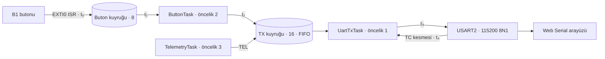
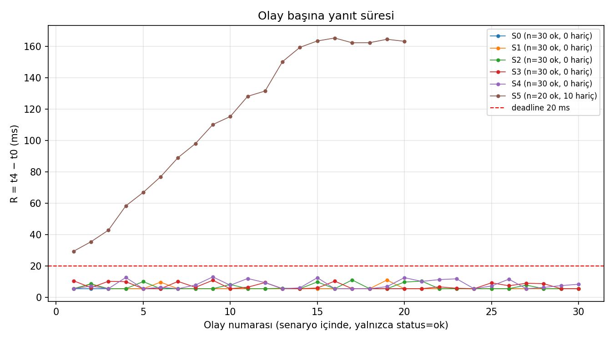
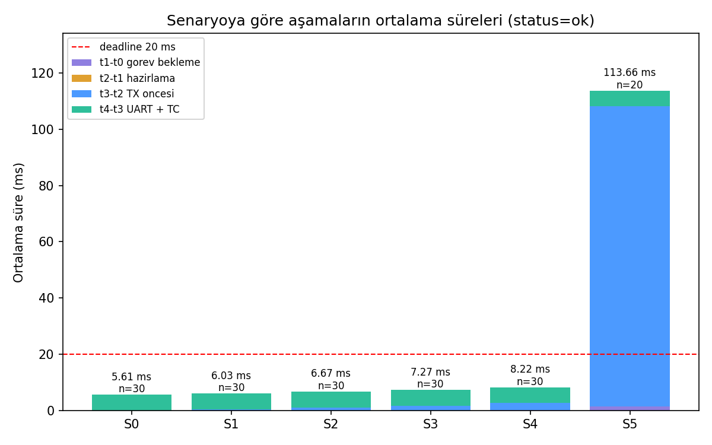

# PressTrace — Yük Altında Buton Yanıt Süresi Analizi (STM32F407VG + FreeRTOS)

STM32F407VG Discovery kartında, FreeRTOS üzerinde çalışan üç görevli bir sistemde bir buton basışının
kartta algılanmasından cevabının son bitinin UART'tan çıkmasına kadar geçen süreyi ölçer:
**R = t₄ − t₀**.

Telemetri hızı (kapalı, 10, 50, 100 Hz) ve ek CPU işi (2 ms, 5 ms) değiştirilerek altı senaryoda
R'nin **ne kadar** ve **hangi aşamada** büyüdüğü gösterilir. Deney bütçesi **R ≤ 20 ms** (yumuşak
gerçek-zaman).

> **Kısa sonuç**
>
> - **S0–S4:** Bütçe tutuyor, 150 basışın hiçbiri 20 ms'yi aşmıyor. R = 5,57 ms hat süresi + en
>   fazla bir satırın kalıntısı (S4'te artı 2 ms'lik iş penceresi); en büyük değer 13,13 ms.
> - **S5 (100 Hz + 5 ms iş):** Sistem doyuma giriyor. UART bir periyotta yalnızca bir satır
>   başlatabiliyor. Her basış kuyruğa kalıcı bir satır ekliyor; R 29 ms'den 165 ms'ye merdiven gibi
>   yükseliyor, kuyruk 16'da dolunca 10 basış düşüyor.

## İçindekiler

1. [Ne ölçülüyor?](#1-ne-ölçülüyor)
2. [Sonuçlar](#2-sonuçlar)
3. [Örnek çıktılar](#3-örnek-çıktılar)
4. [Kart, bağlantılar ve araç sürümleri](#4-kart-bağlantılar-ve-araç-sürümleri)
5. [Derleme, yükleme ve arayüzü başlatma](#5-derleme-yükleme-ve-arayüzü-başlatma)
6. [Senaryo seçimi ve ölçüm adımları](#6-senaryo-seçimi-ve-ölçüm-adımları)
7. [Timer ve FreeRTOS ayarları](#7-timer-ve-freertos-ayarları)
8. [Şartnameden sapmalar ve bilinen sınırlamalar](#8-şartnameden-sapmalar-ve-bilinen-sınırlamalar)
9. [Ham veri, grafik ve rapor bağlantıları](#9-ham-veri-grafik-ve-rapor-bağlantıları)

---

## 1. Ne ölçülüyor?

Bir basış, kartın içinde beş zaman damgasından geçer. Hepsi aynı 32-bit, 1 MHz'lik TIM2 sayacından
alınır; bilgisayar tarafındaki USB gecikmesi ölçüme karışmaz.



| Damga | An                                                           | Aşama                       |
| ----- | ------------------------------------------------------------ | --------------------------- |
| t₀    | Filtrenin kabul ettiği basış kenarında EXTI0 ISR'sinin ilk işi | —                           |
| t₁    | ButtonTask'ta `xQueueReceive` döndü                          | `t₁ − t₀` görev bekleme     |
| t₂    | TX kuyruğuna `xQueueSend`'den hemen önce                     | `t₂ − t₁` hazırlama         |
| t₃    | UartTxTask'ta `uart_start_tx`'ten hemen önce                 | `t₃ − t₂` TX öncesi bekleme |
| t₄    | USART2 TC kesmesinin ilk işi: son stop biti çıktı            | `t₄ − t₃` UART + TC         |

R bu dört aşamanın toplamıdır; sonuçlar hep "hangi aşama büyüdü" diye okunur.

Tasarımın iki temel kararı:

- **UART'ın tek sahibi var.** UART'a yalnızca UartTxTask dokunur (gatekeeper), bu yüzden mutex yok.
  Öncelik üreticide yüksek, serviste düşük tutuldu; kuyruk beklemesi gizlenmesin diye.
- **Ölçüm, ölçülen gecikmeyi değiştirmiyor.** Ölçüm sırasında hatta yalnızca TEL ve BTN satırları
  var. t₃, t₄ ve durum kartın RAM'indeki 64 kayıtlık havuzda tutulur ve ölçüm bitince dökülür. İlk
  sürümde canlı gönderilen sonuç satırı, S5'te birikimi iki katına çıkarıyordu.

## 2. Sonuçlar

Ölçüm tarihi 25 Eylül 2026. Her senaryoda 30 kabul edilmiş basış var, basışlar arası en kısa süre
0,53 s. Ayrıntılı yorum [analysis/report.md](analysis/report.md) içinde.

### 2.1 Senaryo özeti

| Senaryo | Telemetri | Ek iş | ok / drop   | R min / ort / maks (ms)    | > 20 ms | TX kuyruğu tepe |
| ------- | --------- | ----- | ----------- | -------------------------- | ------- | --------------- |
| S0      | kapalı    | —     | 30 / 0      | 5,603 / 5,608 / 5,613      | 0       | 1               |
| S1      | 10 Hz     | —     | 30 / 0      | 5,605 / 6,026 / 11,146     | 0       | 1               |
| S2      | 50 Hz     | —     | 30 / 0      | 5,605 / 6,672 / 11,190     | 0       | 1               |
| S3      | 100 Hz    | —     | 30 / 0      | 5,606 / 7,266 / 10,985     | 0       | 1               |
| S4      | 100 Hz    | 2 ms  | 30 / 0      | 5,605 / 8,216 / 13,128     | 0       | 2               |
| S5      | 100 Hz    | 5 ms  | **20 / 10** | 29,449 / 113,654 / 165,317 | **20**  | **16**          |

### 2.2 Aşama ortalamaları (ms, yalnızca `ok`)

| Senaryo | t₁−t₀ görev bekleme | t₂−t₁ hazırlama | t₃−t₂ TX öncesi | t₄−t₃ UART + TC |
| ------- | ------------------- | --------------- | --------------- | --------------- |
| S0      | 0,007               | < 0,001         | 0,031           | 5,570           |
| S1      | 0,007               | < 0,001         | 0,449           | 5,570           |
| S2      | 0,007               | < 0,001         | 1,095           | 5,570           |
| S3      | 0,007               | < 0,001         | 1,688           | 5,570           |
| S4      | 0,296               | < 0,001         | 2,349           | 5,570           |
| S5      | 1,551               | < 0,001         | 106,533         | 5,570           |

### 2.3 Grafikler

Olay numarası → R, 20 ms deadline çizgisi:



Senaryo → aşamaların ortalama süreleri, yığılmış sütun:



### 2.4 Ne oldu, neden?

- **Hat süresi sabit.** `t₄ − t₃` altı senaryonun hepsinde 5,570 ms; teori 64 × 10 / 115200 =
  5,556 ms. Aradaki 14 µs başlatma ve kesme girişi. t₄ DMA'nın "aktarım bitti" kesmesinden
  alınsaydı ~87 µs kısa çıkardı. Bu sabit, saat, baud ve "t₄ = son stop biti" iddiasının kanıtı.
- **S1–S3, kalan servis.** Yalnızca `t₃ − t₂` büyüyor: buton, o anda hatta olan tek satırın
  bitmesini bekliyor. Hattı boş bulan basış sayısı ölçülen 27 / 21 / 13; hat doluluğundan
  hesaplanan 28,3 / 21,7 / 13,3.
- **S4, görev önceliği.** 2 ms'lik iş sırasında ButtonTask CPU alamıyor (`t₁ − t₀` en çok 1,93 ms).
  En kötü durum 2 + 5,57 + 5,57 = 13,14 ms; ölçülen 13,13 ms. 2 + 5,57 < 10 olduğu için borç bir
  periyotta eriyor.
- **S5, başlatma hakkı.**
  - 5 + 5,57 > 10: satır bittiğinde yeni periyodun işi sürüyor. UartTxTask (öncelik 1) bir sonraki
    satırı ancak iş bitince başlatabiliyor. Çıkabilen 20 butonun t₃'ü 10 ms'lik sayaçta hep aynı
    fazda: 8083, 8084 ya da 8086 µs.
  - Başlatma hakkı saniyede 100, yani TEL üretimine eşit. Kuyruk erimiyor: basışlar arasında
    1,6–3,5 s olmasına rağmen her basış bekleme dilimini tam 1 artırıyor (2 → 16).
  - Kuyruk 16'da dolunca düşme başlıyor. Düşen 10 butonun hepsi iş penceresinde gelmiş
    (`t₁ − t₀` = 2,5–4,5 ms); `tx_queue_drop` = 16 = 10 BTN + 6 TEL.

## 3. Örnek çıktılar

Bu bölümdeki bütün örnekler `measurements/` altındaki gerçek ölçümlerden alındı. Aksi belirtilen
yerde değerler yalnızca biçimi göstermek içindir.

### 3.1 Hat satırları (kart → arayüz)

Her satır ASCII'dir, boşlukla 63 bayta tamamlanır ve 64. bayt LF'dir. Bu sabit uzunluk, hat süresini
5,556 ms'ye sabitler. Ayrıntı: [code-notes.md](docs/code-notes.md#paket-protokolü).

**Ölçüm sırasında canlı gelen satırlar.** Bu satırlar arayüzde gösterilir, dosyaya kaydedilmez.
Buradaki TEL değerleri temsilidir; BTN'deki zamanlar S5'in 151 numaralı gerçek olayından alındı.

```text
TEL,<seq>,S<n>,<temp_centi_c>,<temp_raw>,<vdda_mv>,<extra_us>,<period_us>,<txq>
TEL,4512,S5,3150,945,2998,5004,10000,3          <- temsili: 31,50 °C, 5004 µs ek iş, kuyrukta 3

BTN,<event_id>,S<n>,PRESSED,<seq>,<t0>,<t1>,<t2>
BTN,151,S5,PRESSED,<seq>,595954204,595958067,595958068

ACK,<seq>,S<n>                                   <- kart senaryo değişikliğini onaylar
```

**"Ölçümü bitir" sonrası döküm.** Aşağıdaki satırlar S5 ölçümünün CSV değerlerinden birebir yeniden
oluşturuldu. REC satırı zamanları t₀ ve ardışık farklar olarak taşır; bilinmeyen fark boş kalır.
Döküm sırasında kart S0'a geçtiği için CNT ve END satırlarında `S0` görünür.

```text
REC,S<n>,<event_id>,<t0>,<t1-t0>,<t2-t1>,<t3-t2>,<t4-t3>,<status>
REC,S5,151,595954204,3863,1,20015,5570,ok        <- işin içinde basış, 2 dilim bekleme
REC,S5,152,598268135,7,0,29941,5571,ok           <- işin dışında basış, 3 dilim
REC,S5,166,625338337,7,1,159741,5568,ok          <- tavan: 16 dilim
REC,S5,167,627073775,4292,1,,,tx_drop            <- TX kuyruğu dolu: t3/t4 yok
CNT,S0,accepted,30
CNT,S0,tx_queue_drop,16
CNT,S0,tx_queue_max,16
CNT,S0,tel_period_avg_us,9999
END,S0,30                                        <- kartın gönderdiği REC sayısı
```

Kart kaybın nerede olduğunu `tx_drop` / `btn_drop` diye ayırır. Arayüz CSV'ye şartnamedeki `drop`
değerini yazar; nerede düştüğü dolu zamanlardan anlaşılır.

### 3.2 Olay CSV'si: `measurements/S<n>.csv`

Şartname biçimi: `scenario,event_id,t0_us,t1_us,t2_us,t3_us,t4_us,status`. Zamanlar mutlak TIM2
değerleridir (µs); bilinmeyen zaman **boş** bırakılır, 0 yazılmaz.

[S0.csv](measurements/S0.csv), ilk beş olay (telemetri kapalı):

```csv
scenario,event_id,t0_us,t1_us,t2_us,t3_us,t4_us,status
S0,1,53525996,53526002,53526003,53526032,53531603,ok
S0,2,55732014,55732021,55732021,55732051,55737620,ok
S0,3,61674052,61674059,61674060,61674090,61679663,ok
S0,4,65474782,65474789,65474790,65474819,65480391,ok
S0,5,68109329,68109336,68109336,68109366,68114935,ok
```

[S5.csv](measurements/S5.csv), seçilmiş satırlar (100 Hz + 5 ms iş):

```csv
scenario,event_id,t0_us,t1_us,t2_us,t3_us,t4_us,status
S5,151,595954204,595958067,595958068,595978083,595983653,ok
S5,152,598268135,598268142,598268142,598298083,598303654,ok
S5,153,599910791,599910797,599910798,599948083,599953654,ok
S5,165,623540228,623540234,623540235,623698084,623703656,ok
S5,166,625338337,625338344,625338345,625498086,625503654,ok
S5,167,627073775,627078067,627078068,,,drop
S5,168,627601385,627601392,627601393,627758084,627763655,ok
S5,180,651580444,651580451,651580452,651738084,651743651,ok
```

S5'te dikkat edilecek üç şey:

- `t3_us` değerlerinin son dört hanesi hep `8083`, `8084` ya da `8086`: gönderim 10 ms'lik
  periyotta tek bir fazda başlayabiliyor.
- 167 numaralı olayda t₀–t₂ var, t₃ ve t₄ boş: basış algılandı, cevap hazırlandı, ama TX kuyruğu
  dolu olduğu için düştü.
- `t3_us − t2_us` 151'de ~20 ms, 165'te ~158 ms: kuyruk birikiyor.

### 3.3 Bir satırı çözmek

Aynı satırdan dört aşama ve R şöyle hesaplanır (farklar mod 2³², yani TIM2 başa sarsa da doğru):

| Olay    | t₁−t₀   | t₂−t₁ | t₃−t₂     | t₄−t₃   | **R**         | Yorum                                            |
| ------- | ------- | ----- | --------- | ------- | ------------- | ------------------------------------------------ |
| S0 #1   | 6 µs    | 1 µs  | 29 µs     | 5571 µs | **5607 µs**   | Boş sistem: R'nin %99'u hat                      |
| S5 #151 | 3863 µs | 1 µs  | 20 015 µs | 5570 µs | **29 449 µs** | İşin içinde basış + 2 dilim kuyruk; bütçe aşıldı |

Python ile tüm senaryo için:

```python
import pandas as pd

M = 2**32
d = pd.read_csv("measurements/S5.csv")
ok = d[d.status == "ok"]
R_ms = ((ok.t4_us - ok.t0_us) % M) / 1000
print(R_ms.describe())                  # count 20, min 29.449, max 165.317
print((d.status == "drop").sum())       # 10
```

### 3.4 Pencere sayaçları: `measurements/S<n>_counters.csv`

Olay satırı olmayan bilgiler ayrı dosyadadır. [S5_counters.csv](measurements/S5_counters.csv):

| Sayaç                                          | Değer                | Anlamı                                                       |
| ---------------------------------------------- | -------------------- | ------------------------------------------------------------ |
| `accepted`                                     | 30                   | Filtrenin kabul ettiği basış (= CSV satır sayısı)            |
| `repeat`                                       | 68                   | 30 ms içinde gelip elenen sıçrama kenarı                     |
| `btn_queue_drop`                               | 0                    | Buton kuyruğu (8) hiç dolmadı                                |
| `tx_queue_drop`                                | **16**               | TX kuyruğuna giremeyen satır: 10 BTN + 6 TEL                 |
| `tx_queue_max`                                 | **16**               | TX kuyruğunun en yüksek doluluğu (yüksek su seviyesi)        |
| `pool_overflow` / `droplog_overflow`           | 0 / 0                | Kayıt havuzu (64) ve düşen olay kaydı (32) taşmadı           |
| `tx_timeout` / `tx_start_fail` / `spurious_tc` | 0 / 0 / 0            | UART sürücüsünde hata yok                                    |
| `encode_error`                                 | 0                    | 63 bayta sığmayan satır yok                                  |
| `tel_sent`                                     | 7663                 | Pencerede gönderilen TEL satırı                              |
| `tel_period_min/avg/max_us`                    | 9390 / 9999 / 10 001 | Gerçek telemetri periyodu. En kısa değer yalnızca pencerenin ilk periyodu |
| `host_rec_received` / `host_rec_expected`      | 30 / 30              | Arayüzün aldığı REC = kartın END'de bildirdiği               |
| `host_seq_gaps` / `host_line_errors`           | 0 / 0                | Hatta satır kaybı ya da bozuk satır yok                      |

`host_*` satırlarını arayüz ekler; diğerleri karttan gelir.

### 3.5 Özet tablo: `measurements/summary.csv`

`analysis/analyze.py` altı senaryonun CSV'lerinden tek bir özet tablo üretir. Dosyanın ilk satırları:

```csv
scenario,telemetry_hz_nominal,extra_load_ms_nominal,n_events,n_ok,n_drop,n_tx_error,n_timeout,drop_btn_queue,drop_tx_queue,n_other,r_min_ms,r_mean_ms,r_p95_ms,r_max_ms,deadline_miss,wait_mean_ms,prep_mean_ms,txq_mean_ms,uart_mean_ms,accepted,repeat,btn_queue_drop,tx_queue_drop,tx_queue_max,pool_overflow,droplog_overflow,tx_timeout,tx_start_fail,spurious_tc,tel_sent,tel_period_avg_us,tel_rate_hz_measured,notes
S0,0,0,30,30,0,0,0,0,0,0,5.603,5.608,5.613,5.613,0,0.007,0.001,0.031,5.57,30,21,0,0,1,0,0,0,0,0,0,,,
S5,100,5,30,20,10,0,0,0,10,0,29.449,113.654,164.538,165.317,20,1.551,0.001,106.533,5.57,30,68,0,16,16,0,0,0,0,0,7663,9999,100.01,
```

| Sütun grubu                    | Sütunlar                                                     |
| ------------------------------ | ------------------------------------------------------------ |
| Olay sayıları                  | `n_events`, `n_ok`, `n_drop` (`drop_btn_queue` / `drop_tx_queue`), `n_tx_error`, `n_timeout` |
| R istatistikleri (yalnızca ok) | `r_min_ms`, `r_mean_ms`, `r_p95_ms`, `r_max_ms`, `deadline_miss` (R > 20 ms) |
| Aşama ortalamaları             | `wait_mean_ms` (t₁−t₀), `prep_mean_ms` (t₂−t₁), `txq_mean_ms` (t₃−t₂), `uart_mean_ms` (t₄−t₃) |
| Pencere sayaçları              | `accepted`, `repeat`, kuyruk düşmeleri ve tepesi, taşmalar, UART hataları |
| Telemetri                      | `tel_sent`, `tel_period_avg_us`, `tel_rate_hz_measured`      |
| Uyarılar                       | `notes`: 30'dan az olay ya da `accepted` ≠ kayıt sayısı      |

### 3.6 Analizi çalıştırmak

```bash
pip install pandas matplotlib
python analysis/analyze.py
```

Betik kendi konumuna göre `measurements/` klasörünü bulur. Özet tabloyu ekrana basar, dosyaları
yazar ve son satırda ürettiği grafikleri listeler:

```text
grafikler: r_vs_event.png, stages_by_scenario.png
```

Üretilen dosyalar: `measurements/summary.csv`, `analysis/plots/r_vs_event.png`,
`analysis/plots/stages_by_scenario.png`. Grafikler ve özet her zaman aynı ham CSV'lerden üretilir.

### 3.7 Arayüz

`interface/index.html` Chrome ya da Edge'de açılır; kurulum gerektirmez (Web Serial API).

| Panel                     | Gösterdiği                                                   |
| ------------------------- | ------------------------------------------------------------ |
| Bağlantı                  | Port seçimi, bağlan / kes; 115200 8N1 sabit                  |
| Senaryo                   | S0–S5 düğmeleri; vurgulanan düğme kartın onayladığı senaryodur |
| Durum                     | Aktif senaryo, bu penceredeki basış sayısı, son olay kimliği, sıra boşluğu, hatalı satır, pencere sayaçları |
| Telemetri                 | Sıcaklık, ham ADC / VDDA, gerçek periyot (ms / Hz), TX kuyruğu doluluğu, `extra_load_us` |
| Olaylar                   | Her basışta "Butona basıldı" bildirimi; t₀–t₄, R, 20 ms bütçesi ve durum tablosu |
| Gecikme dağılımı          | Seçili olayın ve ortalamanın dört aşamaya bölünmüş çubuğu, 20 ms çizgisi, pay |
| Grafik                    | Olay → R, 20 ms çizgisi                                      |
| Ölçümü bitir / CSV Kaydet | Kartın kayıtlarını döker, bütünlüğü kontrol eder, `S<n>.csv` ve `S<n>_counters.csv` indirir |

## 4. Kart, bağlantılar ve araç sürümleri

| Bileşen                | Detay                                                        |
| ---------------------- | ------------------------------------------------------------ |
| Kart                   | STM32F407VG Discovery (MCU: STM32F407VGT6, Cortex-M4F, 168 MHz) |
| Buton                  | Kart üzerindeki kullanıcı butonu **B1 (mavi)**: PA0, aktif-HIGH, EXTI0 |
| LED (opsiyonel gözlem) | PD12 (yeşil): her kabul edilen basışta durum değiştirir      |
| UART                   | USART2: **PA2 = TX**, **PA3 = RX**. Kartta USB-UART köprüsü yok; harici 3,3 V USB-TTL adaptör gerekir (bkz. [docs/setup.md](docs/setup.md)) |
| Zaman damgası kaynağı  | TIM2 (32-bit, 1 MHz → 1 µs çözünürlük, serbest sayaç)        |
| Telemetri verisi       | Dahili sıcaklık sensörü (ADC1 kanal 16), fabrika kalibrasyonu + VREFINT ile VDDA düzeltmesi (bkz. [docs/code-notes.md](docs/code-notes.md#telemetri-verisi-kart-sıcaklığı)) |
| IDE / Toolchain        | IAR Embedded Workbench for ARM **9.70.4** (komut satırı `iarbuild` ile de doğrulandı) |
| RTOS                   | [FreeRTOS Kernel](https://github.com/FreeRTOS/FreeRTOS-Kernel) **V11.1.0+** (commit `8be86d4`, 2026-08-26), port `portable/IAR/ARM_CM4F`, `heap_4` |
| CMSIS                  | ARM CMSIS-Core 5.3 (Cortex-M4) + ST CMSIS STM32F4 Device paketi 2.6.11 (bkz. [docs/code-notes.md](docs/code-notes.md#üçüncü-parti-bileşenler)) |
| Arayüz                 | Tarayıcı tabanlı, Web Serial API (`interface/`); kurulum gerektirmez, Chrome / Edge |
| Analiz                 | Python 3.11, pandas, matplotlib (`analysis/analyze.py`)      |

Bağlantı:

| USB-TTL adaptör | Kart                                           |
| --------------- | ---------------------------------------------- |
| RX              | PA2 (USART2_TX)                                |
| TX              | PA3 (USART2_RX): arayüzden senaryo komutu için |
| GND             | GND                                            |

## 5. Derleme, yükleme ve arayüzü başlatma

Ayrıntılı adımlar [docs/setup.md](docs/setup.md) içinde.

1. **FreeRTOS kaynakları:** `firmware/Middlewares/FreeRTOS-Kernel` altındadır. Klasör boşsa (depo
   alt modül olarak klonlandıysa) çekin: `git submodule update --init --recursive`.
2. **Projeyi açın:** IAR EWARM'da `firmware/EWARM/odev_1.eww`. **Debug** yapılandırması hazırdır:
   cihaz ST STM32F407VG, FPU VFPv4 single precision, optimizasyon Low; kaynaklar, include yolları,
   tanımlar, linker dosyası ve ST-LINK ayarlı.
3. **Derleyin:** Project → Make (F7). Beklenen: 0 hata, 0 uyarı. Komut satırından:
   `iarbuild firmware/EWARM/odev_1.ewp -build Debug -log warnings`.
4. **Yükleyin:** Project → Download and Debug (Ctrl+D), ardından Go (F5).
5. **Bağlayın:** USB-TTL adaptörü PA2 / PA3 / GND'ye bağlayın.
6. **Arayüz:** `interface/index.html` dosyasını Chrome veya Edge ile açın, **Bağlan**'a basıp
   adaptörün portunu seçin.

## 6. Senaryo seçimi ve ölçüm adımları

| ID   | Telemetri      | Ek CPU işi      | Amaç                           |
| ---- | -------------- | --------------- | ------------------------------ |
| S0   | Kapalı         | Yok             | Referans (yüksüz) yanıt süresi |
| S1   | 10 Hz (100 ms) | Yok             | Düşük telemetri sıklığı        |
| S2   | 50 Hz (20 ms)  | Yok             | Orta telemetri sıklığı         |
| S3   | 100 Hz (10 ms) | Yok             | Yüksek telemetri sıklığı       |
| S4   | 100 Hz (10 ms) | ~2 ms / periyot | Ek CPU yükü                    |
| S5   | 100 Hz (10 ms) | ~5 ms / periyot | Daha yüksek CPU yükü           |

- **Senaryo seçimi:** Yeniden derleme gerekmez; senaryo **arayüzün Senaryo panelinden** seçilir.
  Kart komutu periyot sınırında uygular ve onaylar (bkz.
  [docs/code-notes.md](docs/code-notes.md#senaryo-komutu)).
- **`ACTIVE_SCENARIO`:** `main.h` içindeki bu değer yalnızca açılış senaryosudur.
- **Bağlantı şartı:** Komutun karta gidebilmesi için USB-TTL adaptörün **TX** ucu kartın **PA3**
  pinine bağlı olmalıdır.

Her senaryo için:

1. **Senaryoyu seçin.** Düğme, kart onayladığında vurgulanır. Liste, kartın kayıt havuzu ve tüm
   pencere sayaçları sıfırlanır; yeni ölçüm penceresi başlar.
2. **5 saniye ısınma bekleyin.** Telemetri panelinde gerçek periyot (100 / 20 / 10 ms) ve
   `extra_load_us` (S4 ≈ 2000 µs, S5 ≈ 5000 µs) hedefle uyumlu olmalı.
3. **En az 30 basış yapın.** Aralarında en az 0,5 s olsun; rahat tempo saniyede bir basış. Kart
   havuzu 64 olay tutar. Her basış canlı görünür, t₃ / t₄ ve durum kartta kalır.
4. **"Ölçümü bitir ve kayıtları al"**'a basın. Kart telemetriyi durdurur (S0), kuyruğu boşaltır ve
   `REC`, `CNT`, `END` satırlarını gönderir. Özet satırının "Kayıt bütünlüğü tam" dediğini kontrol
   edin.
5. **"CSV Kaydet"**'e basın. İki dosya iner, ikisini de `measurements/` altına koyun: `S<n>.csv`
   (olaylar) ve `S<n>_counters.csv` (pencere sayaçları).
6. **Analiz:** Altı senaryo bitince `python analysis/analyze.py` çalıştırın.

## 7. Timer ve FreeRTOS ayarları

| Ayar                   | Değer                                                        |
| ---------------------- | ------------------------------------------------------------ |
| MCU saati              | HSE 8 MHz → PLL → SYSCLK **168 MHz**; AHB 168, APB1 42, APB2 84 MHz |
| RTOS tick              | `configTICK_RATE_HZ` = **1000** (1 ms), preemptive, `configMAX_PRIORITIES` = 5 |
| Zaman damgası          | TIM2, 32-bit serbest sayaç. APB1 bölücüsü ≠ 1 olduğu için timer saati 2 × 42 = 84 MHz; ÷84 = **1 MHz** (1 µs). ~71,6 dakikada sarar; farklar mod 2³² |
| Görev öncelikleri      | `TelemetryTask (3) > ButtonTask (2) > UartTxTask (1)`; Idle = 0 |
| Kuyruklar              | Buton: **8** olay (statik). TX: **16** mesaj, FIFO. TEL / BTN `xQueueSend(…, 0)`: doluysa düşer, üretici beklemez. Kontrol mesajları bloklar |
| UART                   | USART2, **115200 8N1**, kesmeyle gönderim (TXE / TC); görev TC'ye kadar bloklanır (en fazla 50 ms), t₄ TC kesmesinde alınır |
| Mesaj biçimi           | ASCII, boşlukla 63 bayt + LF = **64 bayt** = 5,556 ms (bkz. [docs/code-notes.md](docs/code-notes.md#paket-protokolü)) |
| Kesme öncelikleri      | EXTI0 ve USART2 = 5 (`configLIBRARY_MAX_SYSCALL_INTERRUPT_PRIORITY`), gruplama 4 bit preemption |
| Buton filtresi         | İki kenar + 30 ms sessizlik penceresi + basılı / bırakılmış durumu |
| Kayıt                  | 64 olaylık havuz + 32 olaylık düşen olay kaydı, taşma sayaçlarıyla |
| Deadline / zaman aşımı | `R = t₄ − t₀ ≤ 20 ms`; deney zaman aşımı 1 s                 |
| Derleme                | IAR **Debug** yapılandırması (optimizasyon *Low*). S4 / S5 iş yükü bu ayarla kalibre edildi: 140 000 iterasyon → 8373 µs, buradan 33 440 (2 ms) ve 83 600 (5 ms) iterasyon (`workload.h`) |

## 8. Şartnameden sapmalar ve bilinen sınırlamalar

### 8.1 Şartnameden sapmalar ve eklemeler

| Konu           | Şartname                                           | Bu projede                                                   | Neden                                                        |
| -------------- | -------------------------------------------------- | ------------------------------------------------------------ | ------------------------------------------------------------ |
| Kart           | STM32L476RG ya da eşdeğeri                         | STM32F407VG Discovery                                        | Şartname başka kartlara izin veriyor (UART, buton, µs zaman kaynağı var) |
| Buton kenarı   | Yalnızca basış kenarı, ilk kabulden itibaren 30 ms | İki kenar dinlenir; 30 ms sessizlik + basılı / bırakılmış durumu | İlk S0 ölçümünde bırakma sıçraması ikinci olay üretti: ardışık olaylar arası 60–280 ms, yani basılı tutma süresi. Yalnızca basış kenarıyla 30 ms bunu çözmez (ayrıntı: [code-notes.md](docs/code-notes.md#buton-isrsi-kısa-isr-kopyalanan-olay-kontrol-edilen-sonuç)) |
| Senaryo seçimi | Derleme ayarıyla olabilir; ek komut zorunlu değil  | Arayüzden, 5 baytlık komutla                                 | Yeniden derlemeden senaryo değiştirmek için. Komut yalnızca kullanıcı seçince gider, ölçüm sırasında hatta komut trafiği yok |
| TX zaman aşımı | Deney zaman aşımı 1 s                              | TC bekleme süresi 50 ms, R ≥ 1 s ise `timeout`               | 64 bayt 5,56 ms sürer; kaçan TC görevi 1 s kilitlemesin      |
| Sayaç dosyası  | `S0.csv … S5.csv`, `summary.csv`                   | Ayrıca `S<n>_counters.csv`                                   | Pencere sayaçları (kuyruk tepe, gerçek telemetri hızı, taşmalar) olay satırı değildir; olay CSV'si şartname biçiminde kalır |

### 8.2 Bilinen sınırlamalar

- Gözlenen maksimum, kanıtlanmış en kötü durum (worst-case) değildir; senaryo başına 30 örnek var.
- t₀ fiziksel basma anı değil, filtrenin kabul ettiği kenarın ISR girişidir. t₃ ilk fiziksel bit
  değildir. t₄'e TC kesmesine giriş gecikmesi dahildir.
- Logic analyzer / osiloskopla bağımsız doğrulama yapılmadı. Saati ve baud'u taşıyan dolaylı kanıt,
  `t₄ − t₃`'teki 14 µs'lik farktır.
- Hesaplanan CPU payı (S4 %20, S5 %50) ölçülmüş toplam CPU kullanımı değildir.
- `extra_load_us` arayüzde görünür ama CSV'ye kaydedilmez.
- Pencerenin ilk telemetri periyodu 1 ms'den az kısa ölçülür; ortalama ve en uzun periyot
  etkilenmez.
- Tüm ölçümler tek kartta, Debug / Low derlemeyle alındı. S4 (2 ms) ile S5 (5 ms) arasındaki
  hesaplanan 4,43 ms'lik eşik ayrıca ölçülmedi.

## 9. Ham veri, grafik ve rapor bağlantıları

- **Ham CSV ölçümleri:** [measurements/](measurements/). Olaylar `S0.csv` … `S5.csv`, pencere
  sayaçları `S<n>_counters.csv`, özet tablo `summary.csv`.
- **Analiz betiği:** [analysis/analyze.py](analysis/analyze.py)
- **Analiz raporu:** [analysis/report.md](analysis/report.md)
- **Grafikler:** [analysis/plots/](analysis/plots/). `r_vs_event.png` (olay → R, 20 ms çizgisi),
  `stages_by_scenario.png` (senaryo → aşama süreleri, yığılmış).
- **Kurulum detayları:** [docs/setup.md](docs/setup.md)
- **Kod notları ve tasarım kararları:** [docs/code-notes.md](docs/code-notes.md)
- **AI kullanım notu:** [docs/ai-usage.md](docs/ai-usage.md)

### Dizin yapısı

Şartnamedeki yapıda bu klasörün yeri `freertos-bootcamp/hafta-01/`'dir.

```text
.
├── README.md
├── firmware/
│   ├── Core/                  # Inc/, Src/ (uygulama, sürücüler), Startup/
│   ├── Drivers/CMSIS/         # CMSIS-Core + ST STM32F4 device başlıkları
│   ├── Middlewares/FreeRTOS-Kernel/
│   └── EWARM/                 # IAR projesi (odev_1.eww/.ewp/.ewd), linker dosyası
├── interface/                 # index.html, app.js, style.css (Web Serial)
├── measurements/              # S0–S5.csv, S<n>_counters.csv, summary.csv
├── analysis/                  # analyze.py, report.md, plots/
└── docs/                      # setup.md, code-notes.md, ai-usage.md
```

> **Durum:** Firmware IAR 9.70.4 ile 0 hata / 0 uyarı derleniyor. S0–S5 ölçümleri 25 Eylül 2026'da
> kartta alındı; `measurements/` altındaki bütün CSV'ler gerçek ölçümdür. Kayıt bütünlüğü her
> senaryoda tam (alınan REC = gönderilen, sıra boşluğu 0, hatalı satır 0).
